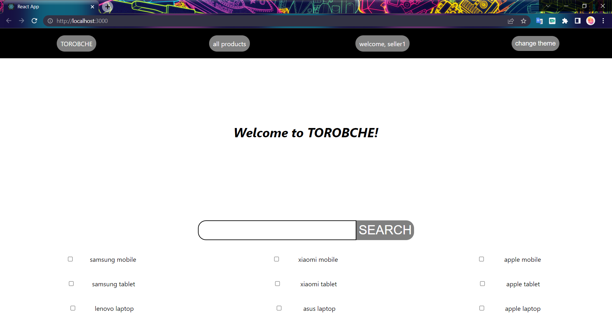
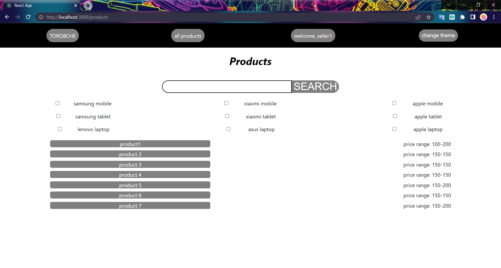
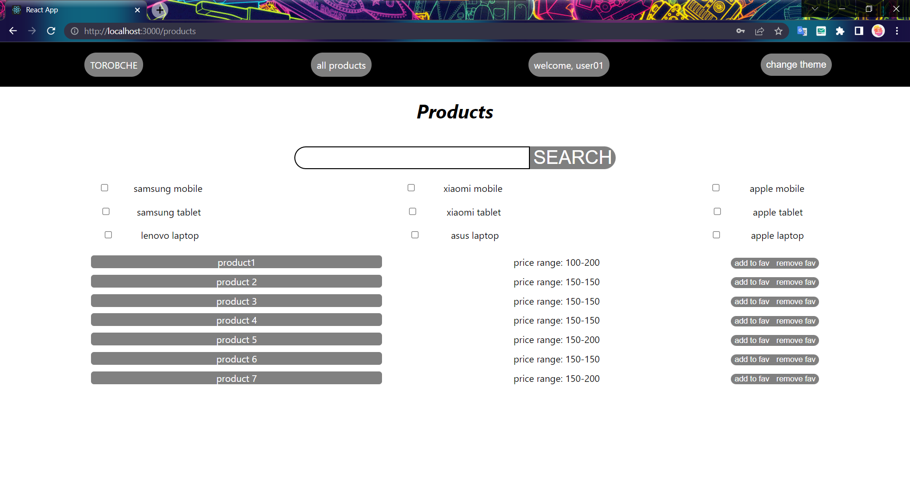

# Torobche (a small version of Torob)

This is the main page. You can search for products here, or press the "all products" button from the navigation bar.

Alternatively, you can access all products by searching for no category and no search query. An empty search query means that you want everything in the categories you selecetd.

Selecting no category means you want to search in everyone of them (It's like you chekced all of the boxes, which is boring :D)

So no boxes selected and no search query = all products.

This is the products page. You can press the grey buttons (which are the name of the products) to go to the product's page.

If you were logged in as a user (not a seller, which is logged in now. You can see it in the third part off navigation bar. And oh, we have dark and light themes too, the fourth button :D), the page would look like this:

Which has the favorite buttons.